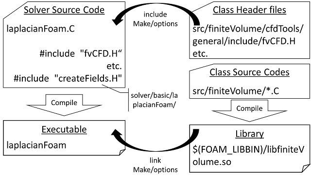

# OpenFOAMのソースコードとコンパイルの基礎（laplacianFoamを中心に）
##### 2014年12月13日オープンCAE勉強会＠富山(富山県立大学　中川慎二)


## Disclaimer

   OPENFOAM® is a registered trade mark of OpenCFD Limited, the producer of the OpenFOAM software and owner of the OPENFOAM® and OpenCFD® trade marks. This offering is not approved or endorsed by OpenCFD Limited.


## 注意

　本資料の内容は，OpenFOAMユーザーガイド，プログラマーズガイド，OpenFOAM Wiki，CFD Online，その他多くの情報を参考にしています。開発者，情報発信者の皆様に深い謝意を表します。

　この講習内容は，講師の個人的な経験（主に，卒研生等とのコードリーディング）から得た知識を共有するものです。この内容の正確性を保証することはできません。この情報を使用したことによって問題が生じた場合，その責任は負いかねますので，予めご了承ください。


## 参考

OpenFOAM UserGuide　3.2 Compiling applications and libraries
http://www.openfoam.org/docs/user/compiling-applications.php


## 1. 基礎の基礎
　OpenFOAMでは，wmakeコマンドを利用してコンパイル作業を実施する。wmakeは，OpenFOAMでの作業を快適にするためのスクリプト OpenFOAM/OpenFOAM-2.3.x/wmake/wmake である。

　wmakeは，linuxの make コマンドをベースとしている。



　ソースコード中のインクルード `#include` では，その部分にヘッダファイル `*.H` に記載した内容がそのまま転載される。


## 2. laplacianFoam 関連ディレクトリ
ソルバ・ソースコード ディレクトリ
`OpenFOAM-2.3.x/application/solver/basic/laplacianFoam`

ヘッダファイル ディレクトリ（ソルバディレクトリ/Make/optionsで指定）
`OpenFOAM-2.3.x/src/finiteVolume`

全ソルバ共通 ヘッダファイル ディレクトリ（OpenFOAM-2.3.x/wmake/Makefileで設定されている）
`OpenFOAM-2.3.x/src/OpenFOAM`
`OpenFOAM-2.3.x/src/OSspecific/POSIX`


### laplacianFoam directory
ソルバ・ソースコードディレクトリの基本的な構造
````
.
├── Make
│   ├── files    // コンパイルするCファイル，出力する実行ファイル名と場所を指定
│   └── options  // インクルードするヘッダの置き場所，リンクするライブラリの指定
├── createFields.H
├── laplacianFoam.C
└── write.H
````

#### laplacianFoam ソルバの Make/files

````
laplacianFoam.C

EXE = $(FOAM_APPBIN)/laplacianFoam    //コンパイル後にできる実行ファイルの場所と名前
````

　Make/filesでは，コンパイルが必要なソースコード（.C）を指定する。さらに，`EXE = `で，コンパイルしてできる実行ファイルの置き場所と名前を指定する。

`#include`で読み込んでいるヘッダファイル（.H）は，その場所に転載されているので，ここで指定する必要はない。


## 3. ヘッダファイルの捜索場所と順序

コンパイル時，次の順序で，ヘッダファイルが捜索される。

1. OpenFOAMで規定したディレクトリ　$WM_PROJECT_DIR/src/OpenFOAM/lnInclude directory

2. ソルバ・ソースコードディレクトリ内にある lnInclude ディレクトリ

3. ソルバ・ソースコードディレクトリ

4. OpenFOAMで規定した環境に依存するディレクトリ $WM_PROJECT_DIR/wmake/rules/$WM_ARCH/

  具体的には， /usr/X11/include と $(MPICH_ARCH_PATH)/include となる

5. Make/optionsファイル内で `-I` オプションによって指定したディレクトリ。［$(LIB_SRC)/finiteVolume/lnInclude］

　なお，ここで指定するのは場所だけである。実際にインクルードされるファイルは，ソースコードにインクルードされているものである。

#### laplacianFoam ソルバの Make/options
````
EXE_INC = \
 -I$(LIB_SRC)/finiteVolume/lnInclude

EXE_LIBS = \
    -lfiniteVolume
````

## 4. ライブラリへのリンク

　ソルバ自身に含まれないクラスは，独立してコンパイルし，実行形式のバイナリファイルを作成する。

　このファイルは，shared object library であり，拡張子 .so がつく。

　ソルバは，このように独立してコンパイル済みの .so ファイルを実行時に呼び出すことができる。dynamic link と呼ぶ方式である。

　laplacianFoam では，`EXE_LIBS = -lfiniteVolume` と指定している。この時，$(FOAM_LIBBIN)/libfiniteVolume.so が実行時に利用される。

　optionsファイルでのライブラリ指定時には，ファイル名先頭のlibと，拡張子.soとを除外した名前を使用する。つまり，-lfiniteVolumeという記述があれば，実際に使われるライブラリのファイル名は，libfiniteVolume.so である。

　この libfiniteVolume.so は，src/finiteVolume に存在するソースコードから生成されたものである。src/finiteVolume/Make/filesファイルを読むと，それが確認できる。

　srcディレクトリ以下には多くのディレクトリが存在する。Makeディレクトリを含むディレクトリでは，ライブラリが作成されている。

　発展（lanrangian編へ続く...）

## 5. ライブラリの捜索場所

次の場所から，リンクする shared object library を見つける。

1.  $FOAM_LIBBIN ディレクトリ

2. 環境に依存するディレクトリ $WM_DIR/rules/$WM_ARCH/ directory
　
　 具体的には /usr/X11/lib と $(MPICH_ARCH_PATH)/lib となる。

3. Make/optionsファイル内で `-L` オプションによって指定したディレクトリ

実際にリンクされるファイルは，次のものとなる。

1. $FOAM_LIBBIN ディレクトリに存在する libOpenFOAM.so

2. OpenFOAM-2.3.x/wmake/rules/ で設定された環境依存場所に存在する libm.so (/usr/X11/lib) と liblam.so ($(LAM_ARCH_PATH)/lib)。OpenFOAM-2.3.x/wmake/Makefileで設定されている。

3. Make/optionsファイル内で `-l` オプションによって指定したライブラリ。ただし，ここで指定する名前は，ライブラリファイル名の先頭にあるlibと拡張子(.so)を取り除いたものである。
　例えば，-lfiniteVolume と指定すると，libfiniteVolume.so が実際のファイルとなる。


#### laplacianFoam ソルバの Make/options

````
EXE_INC = \
 -I$(LIB_SRC)/finiteVolume/lnInclude

EXE_LIBS = \
    -lfiniteVolume
````


## 5. 発展

lagrangian関連ライブラリの紹介

より複雑な構造；複数のライブラリが関連する；改造時に注意が必要

Run-Time selection への対応
lagrangian/intermediate/parcels/include にマクロ

----
##　A1. 参考

#### laplacianFoam ソルバのメインコード
````
// 多くのソルバーで共通するヘッダーファイルの読み込み。OpenFOAMの基盤的な機能を有効にする。
#include "fvCFD.H"
// simple法の機能を使うためのヘッダーファイルを読み込む。
#include "simpleControl.H"

// * * * * * * * * * * * * * * * * * * * * * * * * * * * * * * * * * * * * * //

int main(int argc, char *argv[])
{
    // 多くのソルバーで共通するヘッダーファイルの読み込み。OpenFOAMの基盤的な機能を有効にする。
    #include "setRootCase.H"
    #include "createTime.H"
    #include "createMesh.H"
    // 変数 温度場T，拡散係数DT，設定ディクショナリ transportProperties，の作成とファイルから読込
    #include "createFields.H"

    // simple法のためのクラスから，simple法をコントロールするオブジェクトsimpleを作成
    simpleControl simple(mesh);

    // * * * * * * * * * * * * * * * * * * * * * * * * * * * * * * * * * * * //
    Info<< "\nCalculating temperature distribution\n" << endl;

    // シンプル法のオブジェクトを使って，繰り返し回数をコントロールする
    while (simple.loop())
    {
        Info<< "Time = " << runTime.timeName() << nl << endl;

        // 非直行性補正が有効な場合のみ実行。
        while (simple.correctNonOrthogonal())
        {
            // 非定常拡散方程式から線形代数式を生成して，解く。
            // 非定常項と拡散項をimplicit(陰的)に解く。fvm
            solve
            (
                fvm::ddt(T) - fvm::laplacian(DT, T)
            );
        }

        #include "write.H“     // 結果の出力

        Info<< "ExecutionTime = " << runTime.elapsedCpuTime() << " s"
            << "  ClockTime = " << runTime.elapsedClockTime() << " s"
            << nl << endl;
    } // end of the simple loop

    Info<< "End\n" << endl;

    return 0;
}

````


#### laplacianFoam ソルバの Make/files

````
laplacianFoam.C

EXE = $(FOAM_APPBIN)/laplacianFoam    //コンパイル後にできる実行ファイルの場所と名前
````

Make/filesでは，コンパイルが必要なソースコード（.C）を指定する。

`#include`で読み込んでいるヘッダファイル（.H）は，その場所に転載されているので，ここで指定する必要はない。


#### laplacianFoam ソルバの Make/options

````
EXE_INC = \
 -I$(LIB_SRC)/finiteVolume/lnInclude

EXE_LIBS = \
    -lfiniteVolume
````


#### 参考：src/finiteVolume/cfdTools/general/include/fvCFD.H の内容

````
#ifndef fvCFD_H
#define fvCFD_H

#include "parRun.H"

#include "Time.H"
#include "fvMesh.H"
#include "fvc.H"
#include "fvMatrices.H"
#include "fvm.H"
#include "linear.H"
#include "uniformDimensionedFields.H"
#include "calculatedFvPatchFields.H"
#include "fixedValueFvPatchFields.H"
#include "adjustPhi.H"
#include "findRefCell.H"
#include "constants.H"

#include "OSspecific.H"
#include "argList.H"
#include "timeSelector.H"

#ifndef namespaceFoam
#define namespaceFoam
using namespace Foam;
#endif

#endif
````
